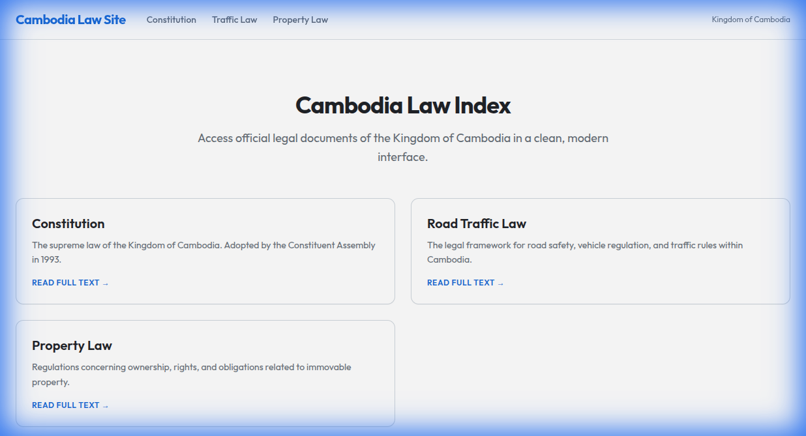
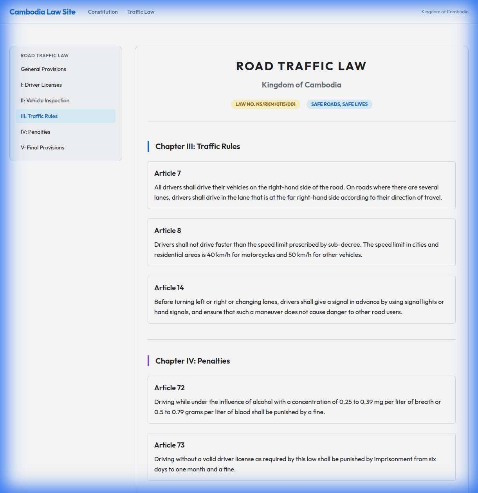
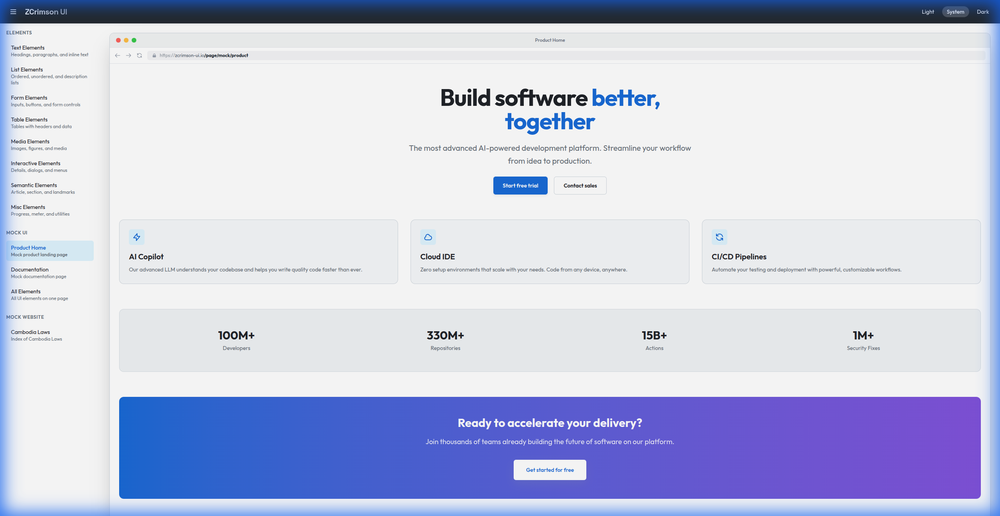

# z-crimson-ui

A comprehensive React UI library and showcase styled with **Tailwind CSS v4.1** using a **GitHub-inspired design system**. Built with **React 19.1**, **react-tea-cup** (TEA architecture), and **fp-ts** for functional programming patterns.

## Screenshots

### Law Library


### Law Details


### Kun Khmer (New)


### Traffic Law Page


### Product Page Mockup


## Features

- 🎨 GitHub Primer-inspired color palette
- 🌓 Light/Dark mode support
- 🏗️ The Elm Architecture (TEA) state management
- 🔧 Functional programming with fp-ts
- 📱 Responsive design
- ♿ Accessibility-focused

## Tech Stack

| Package       | Version |
| ------------- | ------- |
| React         | 19.1    |
| react-tea-cup | 5.1.1   |
| fp-ts         | 2.16.x  |
| Tailwind CSS  | 4.1     |
| Vite          | 6.x     |
| TypeScript    | 5.7.x   |

## Getting Started

### Install dependencies

```bash
npm install
```

### Development

Start the development server:

```bash
npm run dev
```

Open [http://localhost:5173](http://localhost:5173) in your browser.

## Commands

### Development Server

```bash
npm run dev
```

Starts Vite dev server with hot module replacement.

### Lint

```bash
npm run lint
```

Runs ESLint to check for code quality issues. Configuration is in `eslint.config.js`.

### Build

```bash
npm run build
```

1. Runs TypeScript compiler (`tsc -b`) to check types
2. Builds optimized production bundle to `dist/`

### Preview Production Build

```bash
npm run preview
```

Serves the production build locally for testing.

## Project Structure

```
src/
├── main.tsx          # React entry point
├── App.tsx           # TEA Program (init, update, view)
├── types.ts          # TypeScript types, Model, Msg
├── index.css         # Tailwind CSS with GitHub theme
└── components/
    ├── TextElements.tsx
    ├── ListElements.tsx
    ├── FormElements.tsx
    ├── TableElements.tsx
    ├── MediaElements.tsx
    ├── InteractiveElements.tsx
    ├── SemanticElements.tsx
    └── MiscElements.tsx
```

## Element Categories

1. **Text Elements** - Headings, paragraphs, inline text, code blocks
2. **List Elements** - Ordered, unordered, description lists
3. **Form Elements** - All input types, buttons, fieldsets
4. **Table Elements** - Tables with headers, footers, colgroups
5. **Media Elements** - Images, audio, video, SVG, canvas
6. **Interactive Elements** - Details, dialogs, popovers
7. **Semantic Elements** - Article, section, header, footer, nav
8. **Misc Elements** - Progress, meter, kbd, time, mark

## Theme Customization

The GitHub-inspired theme is defined in `src/index.css` using Tailwind v4's `@theme` directive. Colors, typography, spacing, and shadows are defined as CSS custom properties.

### Light/Dark Mode

- Uses CSS `prefers-color-scheme` for automatic detection
- Manual override via `data-theme="dark"` attribute
- Theme toggle in the app header

## License

MIT

## TODO

- [ ] AI regenerate prompt

```
extract all your knowledge about this project to `ai/prompt.md` file, such that I can give this prompt to an AI and it can re-create this project from scratch (at least close enough)

Split the prompt.md into multiple files if necessary, prefix it with number, which can be used as the order of prompt execution: example `1-prompt.md` `2-prompt.md` etc...
```

